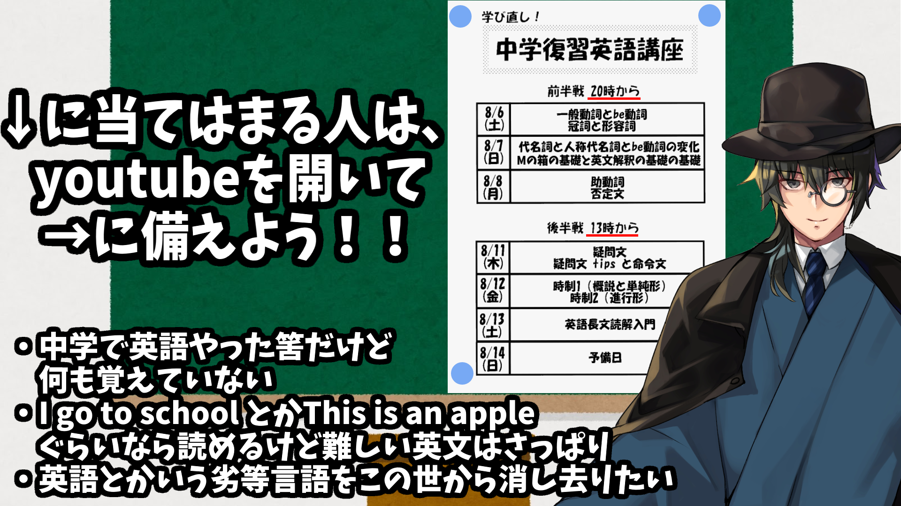

# 動画及び資料一覧

  

|資料|pdf|動画|
|:----:|:----:|:----:|
|[中学復習１　一般動詞とbe動詞](01.md)|[pdf](https://drive.google.com/file/d/1VI5Zk2oaBa4M-KIYAGLBpBTZvWwTfnus/view?usp=sharing)|[生放送](https://www.youtube.com/watch?v=dlfNdYMdIIw)|
|[中学復習２　冠詞と形容詞](02.md)|[pdf](https://drive.google.com/file/d/1JvVUtx39LKySjtD4WsG6DZKvVhu3WRjG/view?usp=sharing)|[生放送](https://www.youtube.com/watch?v=dlfNdYMdIIw)|
|[中学復習３　代名詞と人称代名詞とbe動詞の変化](03.md)|[pdf](https://drive.google.com/file/d/1lzBdYLgoFmGnHOpvv_QIoFogYOCTPpVQ/view?usp=sharing)|[生放送](https://www.youtube.com/watch?v=EqCcOFY4kvE)|
|[中学復習４　Mの箱の基礎、英文解釈の基礎の基礎](04.md)|[pdf](https://drive.google.com/file/d/1KHZa2kRWoxLli_819UnIUmcH8nLmMHGu/view?usp=sharing)|[生放送](https://www.youtube.com/watch?v=EqCcOFY4kvE)|
|[中学復習５　助動詞](05.md)|[pdf](https://drive.google.com/file/d/1Kyd6Ff8SpAqQ96yTw2LJM6AxnzeWWEoK/view?usp=sharing)|[生放送](https://www.youtube.com/watch?v=SAuecV9ssK4)|
|[中学復習６　否定文](06.md)|[pdf](https://drive.google.com/file/d/1Ivz_R7sgyWU-MCLe4gWLeS4Ex2l9zVFu/view?usp=sharing)|[生放送](https://www.youtube.com/watch?v=SAuecV9ssK4)|
|[中学復習７　疑問文](07.md)|[pdf](https://drive.google.com/file/d/1DydNEqB4fWKm5pbx-6scgVVAD4Qdni5k/view?usp=sharing)|[生放送](https://youtu.be/XZkFAHN9gs0)|
|[中学復習８　疑問文tipsと命令文](08.md)|[pdf](https://drive.google.com/file/d/15naomsZWqA19gRCvI20JXc3BdlEHFs1Y/view?usp=sharing)|[生放送](https://youtu.be/XZkFAHN9gs0)|
|[中学復習９　時制１（概説と単純形）](09.md)|[pdf](https://drive.google.com/file/d/1d7Z7AWdkNZyou9d_0YRBLd9w6mGljlnU/view?usp=sharing)|[生放送](https://youtu.be/F2GLAnW6ly8)|
|[中学復習１０　時制２（進行形）](10.md)|[pdf](https://drive.google.com/file/d/1K_qRdXbwty80-fCQF07Epp-3vnf_PiF3/view?usp=sharing)|[生放送](https://youtu.be/F2GLAnW6ly8)|
|[中学復習１１　英文読解入門](11.md)|[pdf](https://drive.google.com/file/d/1Uy4cSTTtNoJz9TDOaINs7kw4UjZ_eesG/view?usp=sharing)|[生放送](https://youtu.be/Y8BohDwpPLg)|